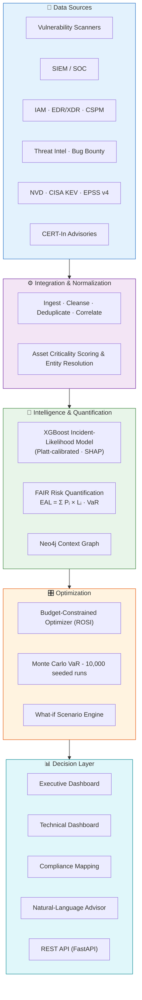
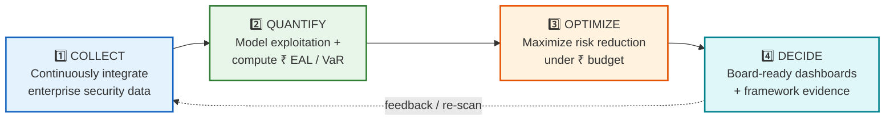
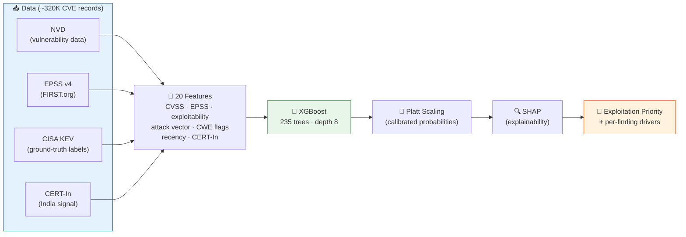
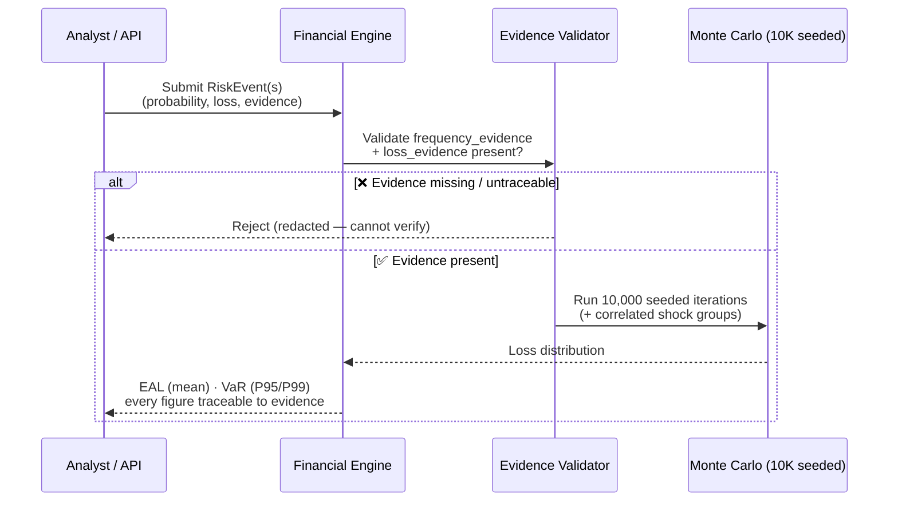
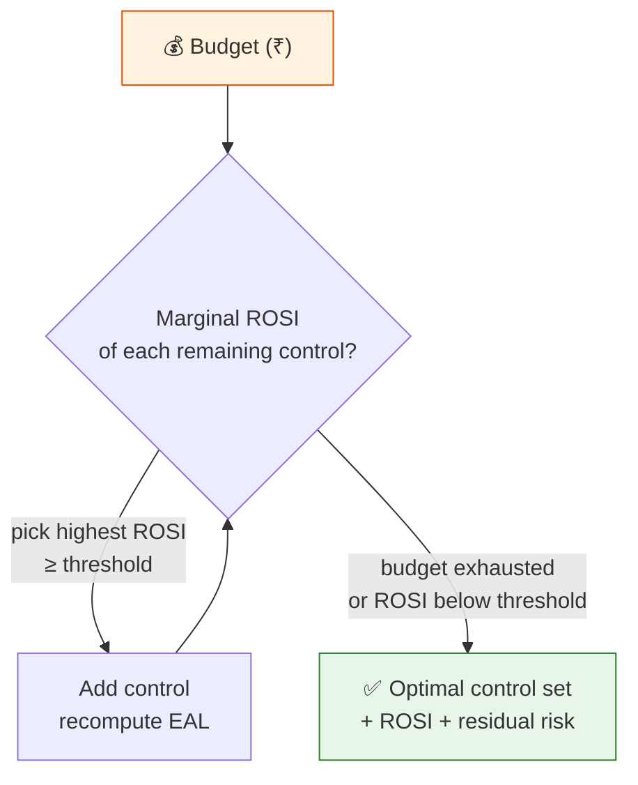
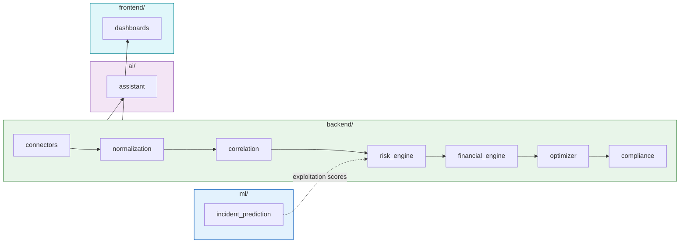
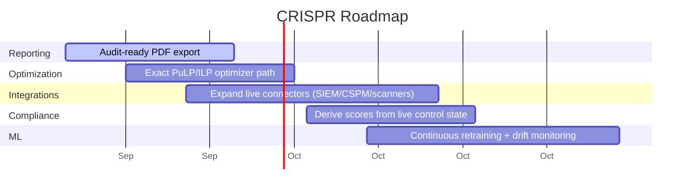

<div align="center">

# CRISPR

### Cyber Risk Intelligence System for Prioritized Remediation

**Not another risk score - a ₹-quantified, source-verified investment decision.**

CRISPR turns tens of thousands of raw security findings into **financial risk a board can act on** - Expected Annual Loss (EAL) and Value at Risk (VaR) in rupees - then recommends the exact set of controls that cuts the most risk under a fixed budget.

[](https://www.python.org/)
[](https://fastapi.tiangolo.com/)
[](https://react.dev/)
[](https://xgboost.readthedocs.io/)
[](https://www.opengroup.org/open-fair)
[](#-testing)
[](LICENSE)

[**🚀 Live Prototype**](https://crispr-hosting.vercel.app/login) · [**🎥 Demo Video**](https://youtu.be/lDz5yODLh9I) · [**💻 Source**](https://github.com/JashwanthMU/CRISPR) · [**📚 Docs**](docs/)

</div>

---

## 📌 TL;DR

Enterprises spend heavily on cybersecurity, yet risk is still reported as vague **"Low / Medium / High"** ratings that never answer the only question leadership asks: *how much money are we exposed to, and where should the next rupee go?*

CRISPR fuses security telemetry with **asset criticality** and **control effectiveness** into a single FAIR-based engine, uses a **calibrated XGBoost model** (trained on **~320,000 CVE records**) to score exploitation likelihood, and a **budget-constrained optimizer** to recommend the highest-impact controls. A **deterministic, evidence-gated financial engine** guarantees that every ₹ figure is traceable to source — the AI narrates numbers, it never invents them.

> **Built for:** Smart India Hackathon 2026 · Problem Statement **SIH26105** (AICTE) · Theme: *Blockchain & Cybersecurity*

---

## 📖 Table of Contents

- [The Problem](#-the-problem)
- [What CRISPR Does](#-what-crispr-does)
- [System Architecture](#-system-architecture)
- [How It Works](#-how-it-works)
- [The ML Model](#-the-ml-model)
- [The Evidence-Gated Financial Engine](#-the-evidence-gated-financial-engine)
- [Investment Optimizer](#-investment-optimizer)
- [Compliance Mapping](#-compliance-mapping)
- [Tech Stack](#-tech-stack)
- [Repository Structure](#-repository-structure)
- [Getting Started](#-getting-started)
- [Usage](#-usage)
- [Testing](#-testing)
- [Security](#-security)
- [Roadmap](#-roadmap)
- [Research & References](#-research--references)
- [Team & License](#-team--license)

---

## 🎯 The Problem

Security findings arrive by the tens of thousands - from scanners, SIEM, EDR, CSPM and threat intel - but they are ranked by **technical severity (CVSS)**, not **business impact**.

> **CVSS ≠ business risk.** A "critical" CVE on an isolated test box matters less than a "medium" on a payment database.

Boards are handed heatmaps that cannot tell them:

- 💰 **How much money** are we exposed to, in rupees?
- 🎯 **Which fixes first** reduce that exposure the most?
- 📊 Is our security spend going to **real business risk** or to noise?
- 📝 Can we **prove to an auditor** why each risk was prioritized?

Manual, periodic assessments go stale - by the time a report is written, assets and threats have changed. The result is alert fatigue, mis-allocated spend, SLA breaches, and cyber risk that never enters board-level financial decisions.

**Why it matters in India (2026):** average data-breach cost hit a record **₹25.5 Cr** (IBM, +15.9% YoY; BFSI highest at ₹40.9 Cr) · Indian BFSI faces attacks at **1.6× the global average** · mean time to contain a breach is **263 days and rising** (DSCI–BCG).

---

## ✨ What CRISPR Does

| | Capability | Description |
|---|---|---|
| 📊 | **Quantify** | Converts technical findings into ₹-denominated **Expected Annual Loss (EAL)** and **Value at Risk (VaR)** using the FAIR model. |
| 🧠 | **Predict** | A calibrated **XGBoost** model scores per-CVE exploitation likelihood from KEV / NVD / EPSS / CERT-In signals, explained with **SHAP**. |
| 🔮 | **Simulate** | Instant **what-if scenarios** - MFA rollout, patch delay, before-vs-after remediation, alternative budget allocations. |
| 🎛️ | **Optimize** | A budget-constrained optimizer selects the control portfolio that **maximizes risk reduction** under a fixed ₹ budget, with **ROSI**. |
| 🛡️ | **Guardrail** | A **deterministic financial engine** cross-checks every ₹ figure against source evidence and refuses anything it cannot trace — preventing hallucinated numbers. |
| 📋 | **Comply** | Maps controls to **ISO/IEC 27001, NIST CSF, CIS, RBI CSF & SEBI CSCRF**. |
| 👥 | **Communicate** | Split **executive** (risk score, financial exposure) and **technical** (control-level drill-down) dashboards + a natural-language advisor: *"Ask CRISPR."* |

---

## 🏗️ System Architecture



---

## 🔄 How It Works

CRISPR runs a four-stage pipeline: **Collect → Quantify → Optimize → Decide** - with AI supporting every stage.



**1 · Collect** - Live connectors (NVD, CISA KEV, GitHub, generic HTTP) plus a normalization layer ingest, cleanse, deduplicate and correlate findings; an asset-criticality engine performs threat-likelihood weighting and entity resolution across sources.

**2 · Quantify** - The XGBoost model scores exploitation likelihood per CVE. The FAIR engine combines Asset Criticality, Control Effectiveness and evidence-backed Loss Magnitude to produce `EAL = Σ (Pᵢ × Lᵢ)` and `VaR = VaRα(L)`.

**3 · Optimize** - A greedy marginal-ROSI optimizer selects the control portfolio maximizing risk reduction under budget; 10,000 seeded Monte Carlo runs produce reproducible 95% / 99% VaR.

**4 · Decide** - Executive and technical dashboards, compliance mapping, and a natural-language advisor turn technical findings into defensible financial decisions.

---

## 🧠 The ML Model

**Incident-Likelihood Model** - an XGBoost classifier that predicts per-CVE exploitation likelihood.



### Model at a glance

| Property | Value |
|---|---|
| **Algorithm** | XGBoost 3.4 · 235 estimators · max depth 8 |
| **Dataset** | ~320,000 CVE records (256K train / 64K test) |
| **Label** | `exploited = is_kev` - CISA KEV catalog only (no synthetic labels, no EPSS in the label) |
| **Positives** | 1,592 KEV CVEs · **imbalance ≈ 200:1 (~0.5% base rate)** |
| **Features** | 20 real features - EPSS score/percentile, CVSS, exploitability & impact sub-scores, attack vector, and CWE-type flags (RCE, SQLi, XSS, buffer overflow, priv-esc, DoS, dir-traversal) |
| **Calibration** | Platt scaling |
| **Explainability** | SHAP (top drivers: EPSS percentile, EPSS score, exploitability score) |

### Evaluation

| Split | ROC-AUC | PR-AUC | Notes |
|---|:---:|:---:|---|
| **Stratified random** | **0.982** | **0.479** | F1 0.524 · Precision 0.575 · Recall 0.481 |
| **5-fold stratified CV** | 0.985 | 0.503 | ±0.002 / ±0.037 |
| **Temporal (forward)** | 0.981 | 0.491 | trains on past, tests on future |
| **Ablation — no EPSS** | 0.853 | 0.124 | isolates EPSS contribution |
| **Calibrated (production)** | 0.982 | 0.481 | deployed model |

> On a **~0.5% base-rate** problem, a random classifier scores PR-AUC ≈ 0.005 - so **PR-AUC 0.479 is ~96× over random**. The ablation shows the full model (0.479) meaningfully outperforms EPSS-derived signal alone: EPSS is our strongest input, not our whole model.

---

## 🛡️ The Evidence-Gated Financial Engine

This is the heart of CRISPR's trust story. The financial engine is **deterministic and evidence-gated**: a loss event **cannot be created** without citing frequency and loss evidence. The AI never derives ₹ figures from a classifier - it narrates numbers the engine computed and traces every one to source.



**How the guardrail is enforced:** each `RiskEvent` requires non-empty `frequency_evidence` and `loss_evidence`; any non-zero control effect requires `control_evidence`; duplicate events are rejected to prevent double-counting; and correlated incidents are modelled explicitly via **shock groups**. Reproducibility is guaranteed by a fixed seed - the same inputs always produce the same VaR.

> **Demo vs Live modes** (`CRISPR_DATA_MODE`): *demo* runs on a seeded reference environment for reproducibility; *live* mode requires organization-approved, persisted, evidence-backed values before any figure is shown.

---

## 🎛️ Investment Optimizer

CRISPR selects the control portfolio that maximizes risk reduction under a fixed budget using a **greedy marginal-ROSI** strategy. Greedy selection is deliberate: it correctly handles **overlapping control benefits** (where two controls reduce the same risk), which a naïve 0/1 knapsack over-counts.



Each candidate control carries a cost, complexity, implementation time, and its effect on the simulated enterprise EAL - so the recommendation is always an **investment decision with a return**, not a checklist.

---

## 📋 Compliance Mapping

Controls are mapped to five frameworks, giving auditors a traceable line from a fix to a control reference.

| Control | ISO/IEC 27001 | NIST CSF 2.0 | CIS v8.1 | RBI CSF | SEBI CSCRF |
|---|:---:|:---:|:---:|:---:|:---:|
| MFA | A.9.4 | PR.AC-7 | CIS-6 | IAM-3 | AC-2 |
| Patching | A.12.6 | PR.IP-12 | CIS-7 | VM-2 | CM-3 |
| Segmentation | A.13.1 | PR.AC-5 | CIS-12 | NS-4 | SC-7 |
| EDR | A.12.2 | DE.CM-4 | CIS-10 | EP-1 | SI-3 |
| Backup | A.12.3 | PR.IP-4 | CIS-11 | BC-2 | CP-9 |

---

## 🧰 Tech Stack

| Layer | Technologies |
|---|---|
| **Backend** | Python 3.12 · FastAPI · Uvicorn · Pydantic v2 · SQLAlchemy 2 · Alembic |
| **ML** | XGBoost · scikit-learn (Platt scaling) · SHAP · NumPy · pandas · SciPy |
| **Data** | PostgreSQL (psycopg 3) · Neo4j (context graph) |
| **Frontend** | React · TypeScript · Vite · Tailwind CSS |
| **Security** | Cryptography · JWT auth · role-based access (executive / technical / reporter) |
| **Infra** | Docker · Docker Compose · GitHub Actions CI · Vercel / AWS EC2 |

---

## 📂 Repository Structure

```text
CRISPR/
├── backend/                    # FastAPI application
│   ├── app/                    # API, auth, models, entry point (main.py)
│   ├── ingestion/              # source ingestion pipeline
│   ├── connectors/             # NVD · CISA KEV · GitHub · generic HTTP
│   ├── normalization/          # unified schema & cleansing
│   ├── correlation/            # multi-source entity resolution
│   ├── asset_intelligence/     # asset criticality scoring
│   ├── risk_engine/            # threat likelihood
│   ├── financial_engine/       # ⭐ evidence-gated EAL/VaR + Monte Carlo
│   ├── scenario_engine/        # what-if simulations
│   ├── optimizer/              # greedy marginal-ROSI control selection
│   ├── compliance/             # framework mapping (ISO/NIST/CIS/RBI/SEBI)
│   ├── controls/               # control catalogue
│   ├── security/               # crypto & secrets
│   ├── services/               # attack paths & orchestration
│   ├── workers/                # background jobs
│   └── tests/                  # backend test suite
├── ml/
│   └── incident_prediction/    # ⭐ XGBoost model, artifacts & training
│       ├── model_config.json   # full metrics, dataset & hyperparameters
│       ├── portable/           # 5-fold boosters + Platt params
│       └── training/           # train & evaluate scripts
├── ai/
│   ├── assistant/              # natural-language advisor ("Ask CRISPR")
│   ├── tools/                  # advisor tools
│   └── knowledge/              # grounding knowledge
├── crispr_products/            # React + TypeScript frontend (Vite)
├── frontend/                   # dashboard frontend
├── data/demo/                  # seeded reference environment
├── docs/                       # architecture, methodology, ML, deployment…
├── docker-compose.yml          # backend · frontend · worker · db
├── install.sh                  # one-command Docker setup
├── Makefile                    # dev / up / down / test / migrate …
└── requirements.txt
```



---

## 🚀 Getting Started

### Prerequisites

- **Docker** & **Docker Compose v2**
- `curl` and `python3` (used for secure key generation)

### Option A — One-command setup (recommended)

```bash
git clone https://github.com/JashwanthMU/CRISPR.git
cd CRISPR
./install.sh
```

`install.sh` verifies your Docker environment, generates a `.env` with secure secrets, builds the images, and starts the full stack.

### Option B — Manual (Make)

```bash
cp .env.example .env          # then fill in the values (see below)
make up                       # build & start all services
make migrate                  # apply database migrations
make logs                     # tail logs
make down                     # stop everything
```

**Handy Make targets:** `dev` · `up` · `down` · `logs` · `migrate` · `test` · `test-backend` · `test-frontend` · `audit`

### Services

| Service | Description |
|---|---|
| `backend` | FastAPI API (Swagger at `/docs` when `API_DOCS_ENABLED=true`) |
| `sih-frontend` | React + Vite dashboard |
| `worker` | Background ingestion / jobs |
| `db` | PostgreSQL |

> Once running, open the frontend (default **http://localhost:5173**) and the API (default **http://localhost:8000**). Confirm exact ports in `docker-compose.yml`.

### Key environment variables (`.env`)

```ini
# Database
POSTGRES_DB= / POSTGRES_USER= / POSTGRES_PASSWORD=

# Auth & demo accounts
AUTH_SECRET=
SIH_EXECUTIVE_EMAIL= / SIH_EXECUTIVE_PASSWORD=
SIH_TECHNICAL_EMAIL=  / SIH_TECHNICAL_PASSWORD=

# Modes & features
CRISPR_DATA_MODE=demo         # demo (seeded) | live (evidence-required)
DEMO_AUTO_SEED=true
NEO4J_ENABLED=false           # enable for the context graph
API_DOCS_ENABLED=true

# External data
NVD_API_KEY=                  # optional — raises NVD rate limits

# LLM advisor (optional)
LLM_ENABLED=false
LLM_BASE_URL= / LLM_API_KEY=
```

---

## 🖱️ Usage

CRISPR ships with two role-based workspaces, reachable from the login screen:

- **👔 Executive** — enterprise risk score, ₹ financial exposure, what-if scenarios, board briefing.
- **🔧 Technical** — control-level drill-down, per-finding SHAP drivers, framework mapping.

Ask the built-in advisor questions like *"What is our highest financial cyber risk today?"* and CRISPR answers in plain English — with every ₹ figure traceable to its evidence.

---

## 🧪 Testing

```bash
make test            # full suite
make test-backend    # backend only
make test-frontend   # frontend only
```

The backend ships **119 test functions across 24 files**, including determinism/reproducibility tests for the financial engine and Monte Carlo, connector tests (CISA KEV, NVD), and AI-assistant fallback tests. CI runs on GitHub Actions (Python 3.12).

---

## 🔐 Security

- **Role-based access control** — executive / technical / reporter roles.
- **JWT authentication** with configurable token lifetime.
- **Encrypted connector credentials** (`INTEGRATION_ENCRYPTION_KEY`); HTTPS-only connectors by default.
- **Evidence-gated financial engine** — untraceable figures are rejected, not displayed.
- **Deterministic, reproducible outputs** — fixed seeds for auditability.

---

## 🗺️ Roadmap



- [ ] **Audit-ready PDF report** export from dashboard + evidence trail
- [ ] **Exact ILP** optimizer path (PuLP) alongside the greedy heuristic
- [ ] **More live connectors** — scanner, SIEM, CSPM adapters beyond the current NVD / KEV / GitHub
- [ ] **Dynamically derived compliance scores** from live control state
- [ ] **Monitored retraining pipeline** with temporal drift detection

---

## 📚 Research & References

CRISPR is built on established, peer-reviewed cyber-risk economics:

1. **Open FAIR** - The Open Group (O-RA): quantitative risk analysis and taxonomy; the foundation for monetizing cyber risk.
2. **Orlando, A. (2021).** *Cyber Risk Quantification: Investigating the Role of Cyber Value at Risk.* Risks, 9(10):184. [DOI: 10.3390/risks9100184](https://doi.org/10.3390/risks9100184)
3. **Gordon, L.A., Loeb, M.P. & Zhou, L. (2020).** *Integrating cost–benefit analysis into the NIST Cybersecurity Framework via the Gordon–Loeb Model.* Journal of Cybersecurity, 6(1):tyaa005. [DOI: 10.1093/cybsec/tyaa005](https://doi.org/10.1093/cybsec/tyaa005)

**Data sources:** NVD · [EPSS v4 — FIRST.org](https://www.first.org/epss/) · [CISA KEV Catalog](https://www.cisa.gov/known-exploited-vulnerabilities-catalog) · CERT-In advisories.

> **What makes CRISPR different:** it combines real CVE/EPSS-driven likelihood, a deterministic ₹ guardrail, a budget-constrained optimizer, and India-specific regulatory mapping (RBI / SEBI) in one deployable platform.

<details>
<summary><strong>Why "CRISPR"?</strong></summary>

Like the gene-editing tool that makes precise, targeted edits, **C**yber **R**isk **I**ntelligence **S**ystem for **P**rioritized **R**emediation makes precise, high-impact edits to your security posture - fixing the risks that actually move financial exposure, not the loudest alerts.

</details>

---

## 👥 Team & License

Built by **Team P0WERH0USE** for **Smart India Hackathon 2026** - Problem Statement **SIH26105**.

Licensed under the **MIT License** - see [LICENSE](LICENSE).

## © Copyright & Usage

© 2026 CRISPR Team. All Rights Reserved.

This project, including its source code, architecture, documentation, designs, workflows, and related materials, is the intellectual property of the CRISPR Team. **No part of this project may be copied, reproduced, modified, distributed, published, or reused in any form without prior written permission from the project owners.**

Unauthorized use, reproduction, or redistribution of this project or substantial portions of its implementation is strictly prohibited.

<div align="center">

**⭐ If CRISPR helped you think about cyber risk in rupees, star the repo.**

*Turning cyber findings into defensible financial decisions.*

</div>
