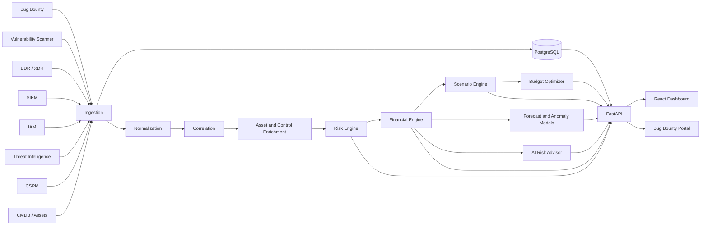

# CRISPR

**Cyber-risk quantification and security investment decision support for Indian enterprises**

CRISPR is a Smart India Hackathon prototype for **Problem Statement ID 26105**. It brings findings from security tools into one asset-aware risk picture, estimates financial exposure in Indian rupees, explains the drivers behind each risk, simulates control changes, and recommends a security portfolio for a given budget.

## SIH 2026 Presentation - Team: P0werh0usE

Our Smart India Hackathon 2026 presentation covers the CRISPR solution, technical architecture, FAIR-based financial risk engine, AI investment optimization, feasibility, impact, and references.

[📄 View SIH 2026 Presentation](docs/presentation/SMART%20INDIA%20HACKATHON%202026.pdf)

## Live Prototype

> **CRISPR Financial Risk Quantification Prototype**

Experience the live CRISPR prototype running on AWS:

[🔗 Open Live Prototype](https://crispr-hosting.vercel.app/login)

The prototype demonstrates how CRISPR converts technical cybersecurity findings into **₹-denominated financial risk** and helps security teams prioritize and optimize remediation decisions.

### What You Can Explore

- **Financial Risk Quantification** - Convert vulnerability and asset data into Expected Annual Loss (EAL)
- **Asset-Weighted Risk Scoring** - Prioritize risks using business and asset criticality rather than CVSS alone
- **Risk Prioritization** - Identify which vulnerabilities create the greatest financial exposure
- **AI Investment Optimization** - Determine the most effective security controls within a defined ₹ budget
- **What-If Scenario Analysis** - Evaluate how security decisions affect financial exposure
- **Natural Language Risk Queries** - Ask questions about organizational cyber risk in business language
- **Compliance Mapping** - Connect findings with relevant cybersecurity and regulatory frameworks
- **Executive Financial View** - Present cyber risk in a format suitable for management and decision-makers

> **Prototype:** The live environment is intended for demonstration and evaluation of the CRISPR financial-risk workflow.

The included fictional organization is **NovaPay Financial Services**, an Indian fintech used only for demonstration.

## Why CRISPR

Security teams often receive isolated alerts from scanners, bug-bounty programs, EDR/XDR, SIEM, IAM, threat intelligence, cloud tools, and asset inventories. Technical severity alone does not show which issue creates the greatest business loss.

CRISPR turns that fragmented evidence into a decision workflow:

```text
Security findings
      ↓
Normalize and correlate by asset
      ↓
Add business criticality and control posture
      ↓
Estimate likelihood and loss magnitude
      ↓
Expected Annual Loss (EAL) in ₹
      ↓
Explain drivers, forecast risk, test scenarios
      ↓
Optimize security investment
```

## Demo Story

The strongest demonstration is the **Authentication API (`A003`)**:

- Corroborated by Bug Bounty, Vulnerability Scanner, XDR, and IAM evidence.
- Evidence confidence is capped at **94%**.
- Business criticality is **96/100**.
- Control posture includes only **58% MFA coverage**.
- Calibrated incident likelihood is **21%**.
- Loss magnitude is **₹3.80 crore**.
- Expected Annual Loss is **₹79.8 lakh**.
- Risk score is **87/100**.

The contrasting **Test Server (`A006`)** has CVSS 9.8 but low business criticality and only **₹3 lakh EAL**, demonstrating that technical severity is not the same as business risk.

Current enterprise demo values:

| Metric | Value |
|---|---:|
| Enterprise risk score | 78/100 |
| Total EAL | ₹1.843 crore |
| Placeholder P95 VaR | ₹5.8976 crore |
| Highest risk | Authentication API (`A003`) |
| Modeled financial risk cases | 5 |
| Demo assets | 20 |
| Seed findings | 72 |

Accepted reports from the live bug-bounty portal are added to the seeded finding count.

## Implemented Capabilities

### Data ingestion and connectors

- PostgreSQL-backed, idempotent ingestion for assets and findings.
- JSON fallback when PostgreSQL is unavailable.
- Connectors for Bug Bounty, Vulnerability Scanner, EDR, XDR, SIEM, IAM, Threat Intelligence, CSPM, and CMDB.
- Source status, per-asset findings, and cross-source grouping APIs.
- Accepted live bug-bounty reports become normalized findings automatically.

### Correlation and asset intelligence

- Pydantic-based unified finding schema.
- Severity normalization and finding deduplication helpers.
- Asset-based correlation and source-diversity confidence scoring.
- Business criticality scoring from operational and regulatory context.
- Weighted control-effectiveness scoring for MFA, EDR, WAF, patching, segmentation, and logging.

### Risk and financial quantification

- Deterministic likelihood calculation.
- India-specific downtime and regulatory cost inputs.
- Loss breakdown across downtime, incident response, recovery, data breach, regulatory, and reputation costs.
- Expected Annual Loss and placeholder P95 VaR.
- Explainable positive and negative risk drivers.

### AI and ML

- Natural-language intent routing for risk, scenario, optimization, forecast, and anomaly questions.
- General cybersecurity question answering with bounded model fallbacks.
- Financial-number guardrail: LLM-generated rupee claims must exist in deterministic engine data.
- Rule-based incident probability predictor with per-feature contributions.
- Isolation Forest detection of unusual failed-login rates.
- Deterministic 90-day linear EAL forecast.
- SHAP-style explanation format with a future XGBoost/SHAP integration point.

### Decision support

- MFA, emergency patching, segmentation, EDR expansion, and patch-delay simulations.
- PuLP 0-1 knapsack optimizer with a greedy fallback.
- Compliance mapping for ISO 27001, NIST CSF, CIS Controls, RBI CSF, and SEBI CSCRF.
- Control costs, risk reduction, remaining budget, and ROSI output.

### User applications

- Executive security and financial-risk dashboard.
- Risk, asset, finding, scenario, investment, compliance, identity, threat-intelligence, and integration views.
- AI Risk Advisor available from the application shell and dashboards.
- Separate authenticated bug-bounty portal for reporters and security reviewers.
- Separate animated product-tour prototype under `crispr_products/`.

## Architecture



### Docker services

The repository has one `docker-compose.yml` that starts the complete stack. Services intentionally use separate containers rather than placing PostgreSQL and web processes in one container.

| Service | Image/build | Host port | Purpose |
|---|---|---:|---|
| `frontend` | Multi-stage React + Nginx build | 5173 | Main CRISPR dashboard |
| `bug-bounty` | Multi-stage React + Nginx build | 3000 | Researcher and triage portal |
| `backend` | Python 3.11 + FastAPI | 8000 | APIs, engines, AI and ML runtime |
| `db` | PostgreSQL 15 | Internal only | Users, reports, assets and findings |

Both Nginx containers proxy `/api/*` to the backend, so browser deployments can use same-origin API requests.

## Quick Start with Docker

### Prerequisites

- Docker Engine or Docker Desktop
- Docker Compose v2 (`docker compose`)
- Ports `3000`, `5173`, and `8000` available

### 1. Configure environment variables

```bash
cp .env.example .env
```

Edit `.env` and replace all placeholders. The AI Advisor can run deterministic templates without an LLM, but general AI answers and polished explanations require an OpenAI-compatible endpoint.

```dotenv
AUTH_SECRET=replace-with-a-long-random-secret
SECURITY_ADMIN_EMAIL=security@example.com
SECURITY_ADMIN_PASSWORD=replace-with-a-long-random-password

LLM_ENABLED=true
LLM_BASE_URL=https://your-compatible-endpoint.example.com/v1
LLM_API_KEY=replace-with-your-api-key
```

The repository-root `.env` is ignored by Git. Never put real credentials in `.env.example`, source files, Dockerfiles, or commits.

### 2. Start the complete application

```bash
docker compose up --build -d
```

Docker waits for PostgreSQL and the backend health check before starting both frontends.

### 3. Open the applications

- Main dashboard: <http://localhost:5173>
- Bug-bounty portal: <http://localhost:3000>
- FastAPI documentation: <http://localhost:8000/docs>
- OpenAPI schema: <http://localhost:8000/openapi.json>
- Health check: <http://localhost:8000/api/health>

### 4. Inspect or stop the stack

```bash
docker compose ps
docker compose logs -f backend
docker compose down
```

PostgreSQL data is retained in the `crispr_postgres_data` volume. To remove all local database state:

```bash
docker compose down -v
```

## Local Demo Authentication

The Docker configuration creates a local security-team account if it does not already exist:

```text
Email:    security@novapay.com
Password: NovaPay-Security-2026
```

These credentials are for local demonstration only. Override them in `.env` before any shared or public deployment.

Researchers register their own `REPORTER` accounts in the bug-bounty portal. Security users can view all reports, review submissions, and trigger ingestion refreshes. Reporter users can only view their own reports.

## Data Pipeline

At backend startup:

1. PostgreSQL tables and indexes are created if required.
2. The default security user is created if absent.
3. `data/demo/assets.json` is upserted by `asset_id`.
4. Source findings are upserted by `finding_id`.
5. Connectors read PostgreSQL first and use JSON fallback on database failure.

Seed datasets:

| File | Source | Records |
|---|---|---:|
| `assets.json` | CMDB asset inventory | 20 |
| `bug_bounty.json` | Bug Bounty | 11 |
| `vulnerabilities.json` | Vulnerability Scanner | 11 |
| `edr_events.json` | EDR | 10 |
| `xdr_events.json` | XDR | 10 |
| `siem_events.json` | SIEM | 10 |
| `iam.json` | IAM | 10 |
| `threat_intel.json` | Threat Intelligence | 10 |

The CSPM connector supports an optional `data/demo/cspm.json`. It reports `disconnected` when that file is absent. CMDB reports asset-inventory status rather than producing security findings.

Manual refresh:

```bash
docker compose exec backend python backend/ingestion/seed.py
```

## Risk Methodology

### Business criticality

Business criticality is a 0–100 weighted score:

```text
30% asset criticality
20% data sensitivity
20% revenue dependency
15% regulatory scope
15% internet exposure
```

### Control effectiveness

```text
25% MFA coverage
20% EDR coverage
20% patch compliance
15% WAF
15% segmentation
 5% logging coverage
```

The prototype caps control effectiveness at 95%.

### Likelihood

```text
25% normalized CVSS
20% exploit availability
15% patch age
15% internet exposure
15% control weakness
10% active threat intelligence
```

### Financial loss

```text
Loss magnitude = downtime
               + incident response
               + recovery
               + data breach
               + regulatory
               + reputation

Modeled loss exposure = annualized likelihood proxy × loss magnitude
Monte Carlo VaR = percentile of simulated annual portfolio loss
```

Regulatory constants and loss multipliers are assumptions and must be replaced or
approved for the target organization. The ML artifact predicts calibrated KEV
membership, not annual incident frequency; APIs disclose the additional CRISPR
environmental and annualization assumptions used for modeled loss exposure.

## Scenario and Investment Models

Scenario values are recomputed from ingested findings, asset loss inputs, and
control posture; there are no calibrated target reductions. Missing findings are
excluded and counted in `calculation_scope`. Patch-delay exposure is compounded
with the formula returned in each response.

The optimizer dynamically recomputes marginal loss-exposure reduction after
each selected control and enforces a configurable minimum marginal ROSI. Control
costs remain planning assumptions until replaced with approved internal/vendor
estimates, and the response says so explicitly.

Production defaults to `CRISPR_DATA_MODE=live`, which reads only rows marked
`data_origin=LIVE` and returns HTTP 503 when required data is missing. Set
`CRISPR_DATA_MODE=demo` only for tests or a clearly labelled presentation.

## AI Risk Advisor

The advisor follows a grounded pipeline:

```text
Question
  ↓
Deterministic keyword intent
  ↓
In-process tool call to risk/scenario/optimizer engine
  ↓
Template answer containing engine facts
  ↓
Optional LLM explanation
  ↓
Financial-number guardrail
```

The LLM is an explanation layer, not the source of financial truth. Every rupee amount in a model-generated risk answer must match a value contained in the deterministic tool data; otherwise the response falls back to the deterministic template.

Supported demo questions include:

- “What is our highest financial cyber risk?”
- “Why is the Auth API high risk?”
- “What happens if we implement MFA?”
- “What if we delay patching by 30 days?”
- “What should we do with ₹1 crore?”
- “Show the 90-day risk forecast.”
- “Are there suspicious failed logins?”
- General cybersecurity questions such as “What is IDOR?”

When `LLM_ENABLED=false` or the model service is unavailable, deterministic risk answers continue to work.

## ML Prototype Modules

| Module | Current implementation | Training status |
|---|---|---|
| Incident prediction | Transparent weighted rule model | No training required |
| Anomaly detection | Isolation Forest over synthetic failed-login-rate features derived from SIEM demo signals | Runtime unsupervised fit |
| Forecasting | Linear EAL drift at 0.77% per day, default 90-day horizon | Not trained |
| Explainability | Contribution ranking in a SHAP-compatible display shape | Rule-based V1 |

Runtime dependencies are in `requirements.txt`. Future XGBoost, pandas, and SHAP experimentation uses:

```bash
pip install -r requirements-ml-v2.txt
```

## API Reference

Interactive request and response schemas are available at `/docs`.

### Health and authentication

| Method | Endpoint | Purpose | Auth |
|---|---|---|---|
| GET | `/api/health` | Backend and database state | No |
| POST | `/api/auth/register` | Create reporter account | No |
| POST | `/api/auth/login` | Issue 12-hour bearer token | No |
| GET | `/api/auth/me` | Return current user | Bearer |

### Findings, ingestion and assets

| Method | Endpoint | Purpose | Auth |
|---|---|---|---|
| GET | `/api/findings` | All connector findings | No |
| GET | `/api/findings/sources` | Connection state and counts | No |
| GET | `/api/findings/correlate` | Findings grouped by asset | No |
| GET | `/api/findings/asset/{asset_id}` | Findings for an asset | No |
| GET | `/api/ingestion/status` | Stored source counts and timestamps | Security |
| POST | `/api/ingestion/refresh` | Re-upsert demo sources | Security |
| GET | `/api/assets` | Enriched asset inventory | No |
| GET | `/api/assets/{asset_id}` | Enriched asset details | No |
| GET | `/api/assets/{asset_id}/controls` | Asset control posture | No |
| GET | `/api/assets/{asset_id}/risk-cases` | Correlated cases for an asset | No |

### Risk, scenarios, optimization and compliance

| Method | Endpoint | Purpose |
|---|---|---|
| GET | `/api/risks` | Five modeled risks sorted by EAL |
| GET | `/api/risks/enterprise` | Enterprise score, EAL, VaR and top risk |
| GET | `/api/risks/{asset_id}` | Risk, loss breakdown and drivers |
| GET | `/api/scenarios` | Run control overrides via query parameters |
| GET | `/api/scenarios/presets` | Four enriched scenario presets |
| GET | `/api/scenarios/{scenario_id}` | Run one preset |
| POST | `/api/optimize` | Optimize a JSON `budget_inr` |
| GET | `/api/optimize?budget=10000000` | Optimize through a query parameter |
| GET | `/api/optimize/controls` | Control catalogue |
| GET | `/api/compliance` | Framework summary |
| GET | `/api/compliance/gaps` | Control gaps with financial impact |
| GET | `/api/compliance/scores` | Raw demo framework scores |

### AI and ML

| Method | Endpoint | Purpose |
|---|---|---|
| POST | `/api/assistant/query` | Ask the AI Risk Advisor |
| GET | `/api/assistant/forecast` | Forecast EAL; supports horizon, step and patch-delay parameters |
| GET | `/api/assistant/anomalies` | Failed-login anomaly scan |

Example:

```bash
curl -X POST http://localhost:8000/api/assistant/query \
  -H 'Content-Type: application/json' \
  -d '{"question":"What is our highest financial cyber risk?"}'
```

### Bug bounty

| Method | Endpoint | Purpose | Auth |
|---|---|---|---|
| POST | `/api/bug-bounty/reports` | Submit a vulnerability report | Bearer |
| GET | `/api/bug-bounty/reports` | Reporter-owned or security-wide queue | Bearer |
| GET | `/api/bug-bounty/reports/{report_id}` | View an authorized report | Bearer |
| PATCH | `/api/bug-bounty/reports/{report_id}/review` | Accept or reject a report | Security |

## Frontend Coverage

The main React dashboard defaults to live API mode. Its API abstraction returns demo fixtures if an optional endpoint is unavailable so the hackathon interface remains navigable.

### Live or substantially connected

- Security and financial dashboards
- Findings and source status
- Assets, controls and risk cases
- Risks and risk drivers
- Scenarios and presets
- Investments and control catalogue
- Compliance and gaps
- AI Advisor, forecast and anomaly APIs
- Identity MFA summaries
- Threat-intelligence finding list
- Integration connection-status display

### Prototype or fixture-backed areas

- Attack-path graph generation
- Code repositories, SAST, SCA/SBOM, secrets and IaC scanning
- Cloud/CSPM findings while `cspm.json` is absent
- Privileged-identity inventory beyond asset-level MFA data
- Threat actors and campaigns
- Remediation workflow and assignments
- Policies and policy evaluation
- Report generation/export
- Persistent settings, organizations and API keys
- Integration connect/reconnect/disable operations
- Historical dashboard trend series

The API Reference screen also shows planned `/api/repositories`, `/api/integrations`, and `/api/analysis/run` routes that are not implemented by the current backend.

## Local Development without Full Compose

### Backend

For the complete database-backed backend during frontend development:

```bash
docker compose up -d db backend
```

For a native Python run using the JSON fallback:

```bash
python3.11 -m venv .venv
source .venv/bin/activate
pip install -r requirements.txt
LLM_ENABLED=false uvicorn backend.app.main:app --reload --port 8000
```

The native fallback supports public connector and risk APIs. Authentication, live ingestion control, and bug-bounty workflows require a reachable PostgreSQL instance; use the Docker backend unless you have configured a local `DATABASE_URL`.

### Main dashboard

```bash
cd frontend
npm ci
npm run dev
```

For a Vite development server, set `VITE_API_URL=http://localhost:8000` because the production Nginx reverse proxy is not present.

### Bug-bounty portal

```bash
cd bug-bounty
npm install
VITE_API_URL=http://localhost:8000 npm run dev -- --port 3000
```

### Animated product tour

`crispr_products/` is a separate TanStack Start/React 19 presentation prototype. It is fixture-driven and is **not** part of the root Docker Compose stack or the source of live platform figures.

```bash
cd crispr_products
npm install
npm run dev
```

## Testing and Validation

Run the backend suite inside the integrated environment:

```bash
docker compose exec backend pytest backend/tests -q
```

Current suite coverage focuses on the scenario engine, optimizer, compliance mapper, and their API routes.

Build both frontend applications:

```bash
cd frontend && npm ci && npm run build
cd ../bug-bounty && npm install && npm run build
```

Useful smoke tests:

```bash
curl http://localhost:8000/api/health
curl http://localhost:8000/api/risks/enterprise
curl http://localhost:8000/api/scenarios/presets
curl http://localhost:8000/api/compliance
```

## PostgreSQL

The database contains:

- `users`: PBKDF2-SHA256 password hashes and `REPORTER`/`SECURITY` roles.
- `bug_bounty_reports`: report content, ownership, status, and review metadata.
- `assets`: JSONB asset payloads keyed by `asset_id`.
- `findings`: JSONB source payloads with indexed source and asset columns.

Open a PostgreSQL shell without exposing port 5432 to the host:

```bash
docker compose exec db psql -U crispr -d crispr
```

## Repository Structure

```text
CRISPR/
├── ai/                         # Advisor routing, tools, model client and guardrail
├── backend/
│   ├── app/api/                # FastAPI routers
│   ├── asset_intelligence/     # Business criticality
│   ├── compliance/             # Framework mappings and gaps
│   ├── connectors/             # Security-source adapters
│   ├── controls/               # Control effectiveness
│   ├── correlation/            # Finding correlation
│   ├── database/               # PostgreSQL connection and schema
│   ├── financial_engine/       # Loss magnitude and EAL
│   ├── ingestion/              # JSON loading and database upserts
│   ├── normalization/          # Unified finding conversion
│   ├── optimizer/              # PuLP/greedy investment optimizer
│   ├── risk_engine/            # Likelihood and drivers
│   ├── scenario_engine/        # What-if simulations
│   └── tests/                  # Backend tests
├── bug-bounty/                 # Reporter and security-review React portal
├── crispr_products/            # Separate animated product-tour prototype
├── data/demo/                  # NovaPay assets and source findings
├── docs/                       # Architecture, methodology and deployment notes
├── frontend/                   # Main React 18 dashboard
├── ml/                         # Prediction, anomaly, forecast and explanation models
├── docker-compose.yml          # Complete application stack
├── requirements.txt            # Runtime Python dependencies
└── requirements-ml-v2.txt      # Optional future training dependencies
```

## Security Notes

Before any non-local deployment:

- Replace every default secret and password.
- Restrict CORS instead of allowing all origins.
- Terminate TLS at a trusted reverse proxy or load balancer.
- Use a managed identity provider and managed secret storage.
- Add rate limiting, audit logging, account lockout, and CSRF protections where applicable.
- Keep PostgreSQL private and back it up.
- Validate and sanitize uploaded or externally sourced connector data.
- Review model endpoint data-handling requirements before sending security context externally.

See [`docs/deployment/aws.md`](docs/deployment/aws.md) for the current AWS deployment walkthrough.

## Current Prototype Limitations

- Five financial risk cases are calibrated demo cases rather than dynamically generated from all 20 assets.
- Asset risk-case correlation currently leaves downstream financial fields as placeholders; the dedicated risk API supplies the calibrated financial cases.
- VaR uses `EAL × 3.2`; Monte Carlo simulation is not implemented.
- Incident prediction is rule-based and forecasting is linear; no trained XGBoost model is bundled.
- Isolation Forest features include deterministic synthetic daily rates derived from SIEM demo signals.
- CSPM has no bundled demo dataset.
- Several broad dashboard pages remain fixture-backed as listed above.
- Main-dashboard authentication and route protection are not yet wired to the existing auth APIs.
- Production observability, migrations, queues, rate limits, and comprehensive test coverage remain future work.

## Team

| Area | Contributor |
|---|---|
| Connectors, ingestion and demo datasets | Harish Kumar N |
| Normalization, correlation, assets and controls | Ishwarya S |
| Risk and financial quantification | Jashwanth MU |
| AI/ML, forecasting and AI Advisor | Michael S |
| Scenarios, optimization and compliance | Kadhiravan EG |
| Dashboard and frontend integration | Karan RJ |

## License

This project is licensed under the [MIT License](LICENSE).
