# CRISPR - System Architecture

> **Cyber Risk Intelligence System for Prioritized Remediation**
> Team PowerHouse · SIH 2026 · PS-26105 · AICTE Cyber Security Cell

---

## Table of Contents

1. [Platform Overview](#1-platform-overview)
2. [High-Level Architecture](#2-high-level-architecture)
3. [Component Architecture](#3-component-architecture)
4. [Data Flow Architecture](#4-data-flow-architecture)
5. [Backend Module Architecture](#5-backend-module-architecture)
6. [AI Layer Architecture](#6-ai-layer-architecture)
7. [ML Pipeline Architecture](#7-ml-pipeline-architecture)
8. [Frontend Architecture](#8-frontend-architecture)
9. [Database Schema](#9-database-schema)
10. [API Architecture](#10-api-architecture)
11. [Deployment Architecture](#11-deployment-architecture)
12. [Security Architecture](#12-security-architecture)

---

## 1. Platform Overview

CRISPR is a six-layer, microservice-based platform that ingests raw security telemetry from enterprise tools, converts it into financial risk exposure denominated in Indian Rupees (₹), and produces actionable investment recommendations bounded by a user-specified budget.

The platform is built to operate entirely on-premise with zero data egress, satisfying the data residency requirements of the RBI Cyber Security Framework and India's Digital Personal Data Protection (DPDP) Act 2023.

**Core design principles:**

- **FAIR methodology** — every ₹ figure traces back to an auditable FAIR calculation (TEF × (1 − CE) × LM)
- **India-first regulatory layer** — RBI, SEBI CSCRF, DPDP Act penalties are first-class inputs to the financial model
- **Deterministic before AI** — every answer from the AI advisor is backed by a deterministic template; the LLM only polishes phrasing and passes through a number guardrail before the answer is returned
- **Modular connector pattern** — each data source (SIEM, EDR, IAM, etc.) is a thin adapter behind a common `fetch_findings()` interface; adding a new source requires one file, not a rearchitecture

---

## 2. High-Level Architecture

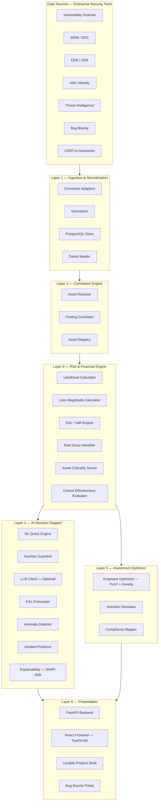

---

## 3. Component Architecture

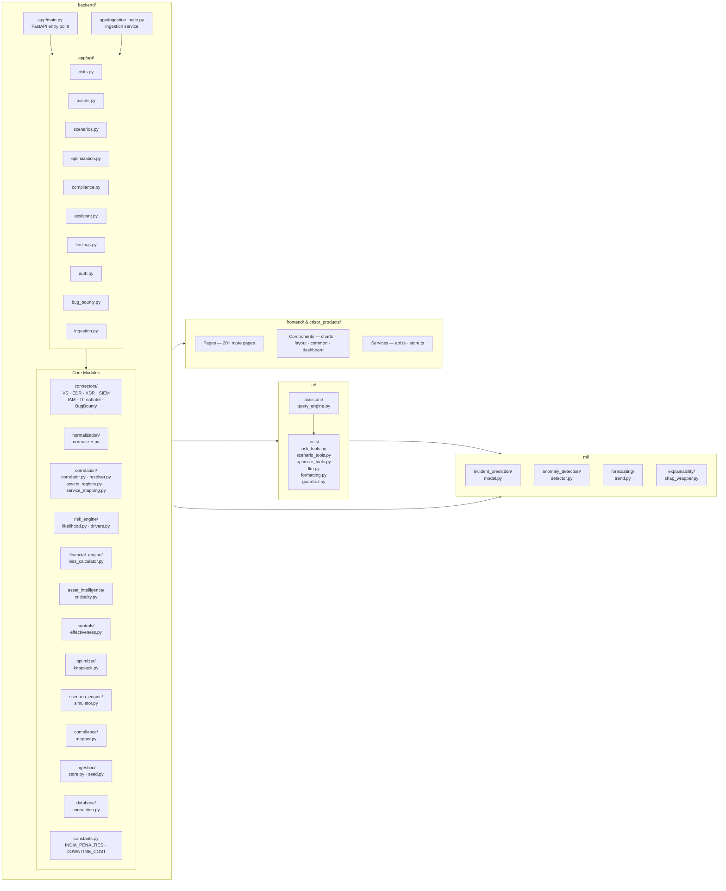

---

## 4. Data Flow Architecture

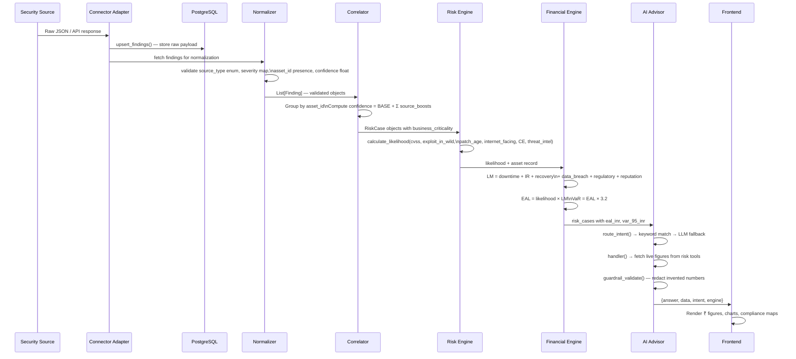

---

## 5. Backend Module Architecture

### 5.1 Connector Layer

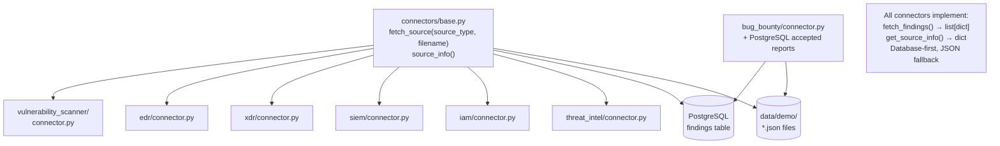

### 5.2 Risk & Financial Engine

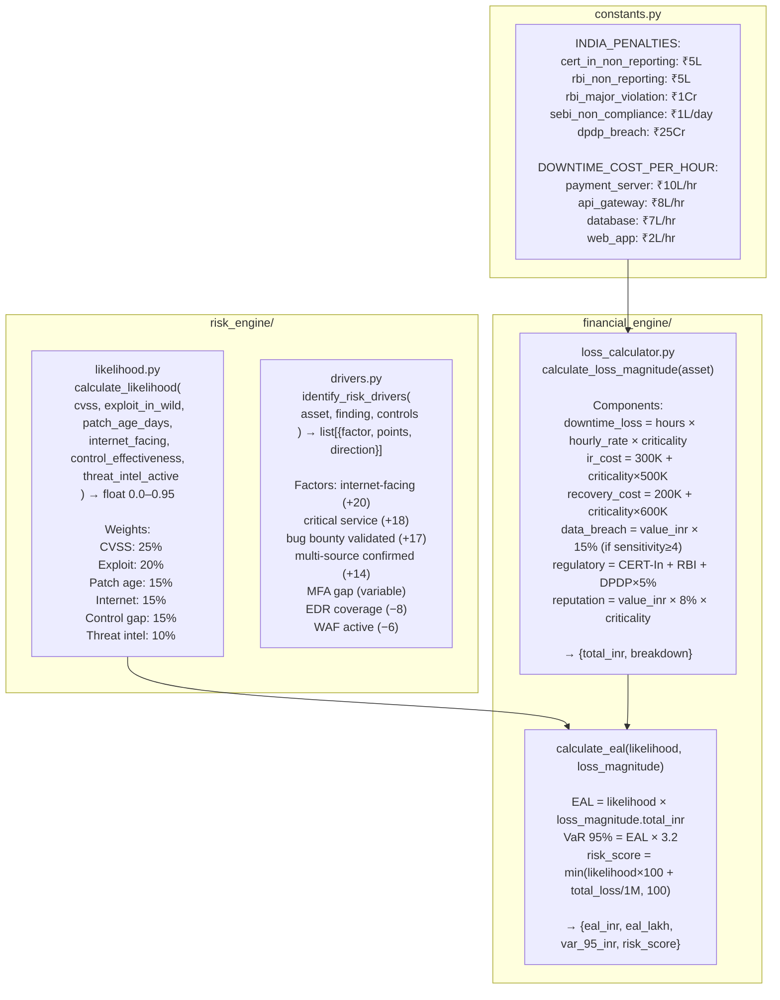

### 5.3 Correlation Engine

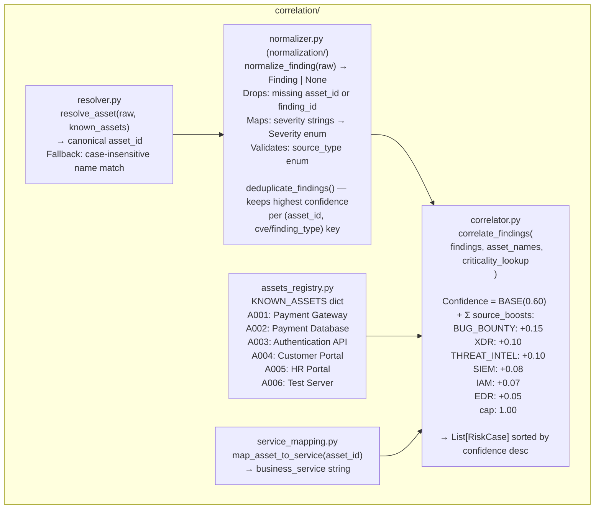

### 5.4 Investment Optimizer

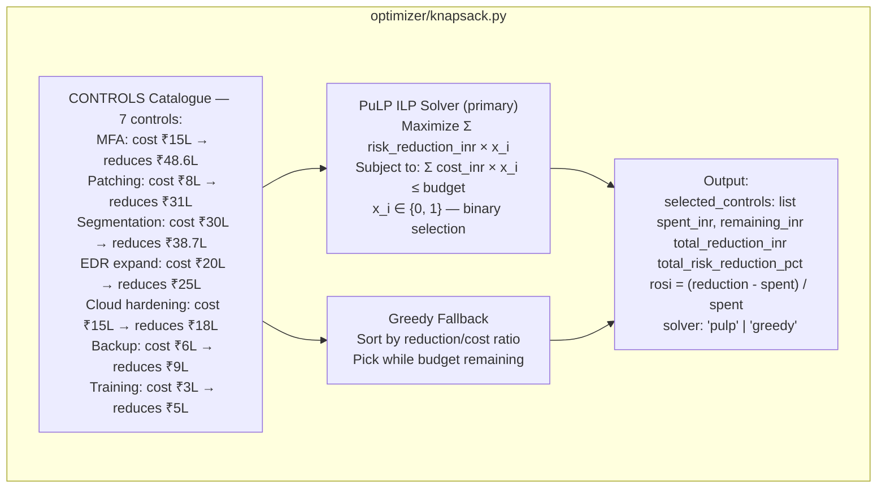

### 5.5 Scenario Engine

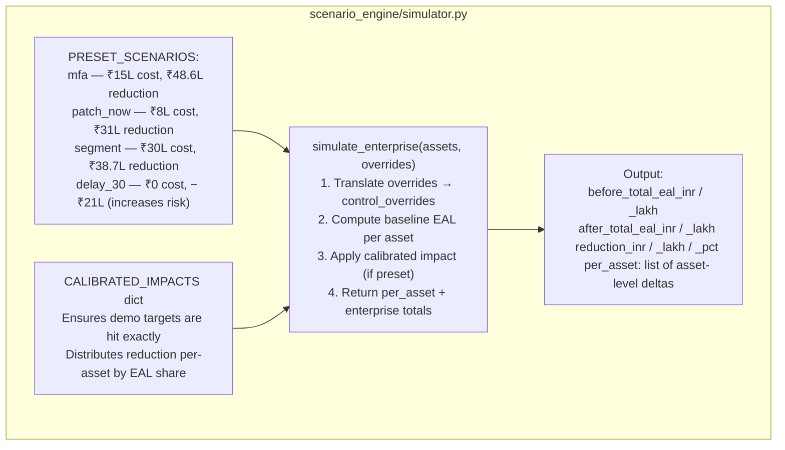

### 5.6 Compliance Mapper

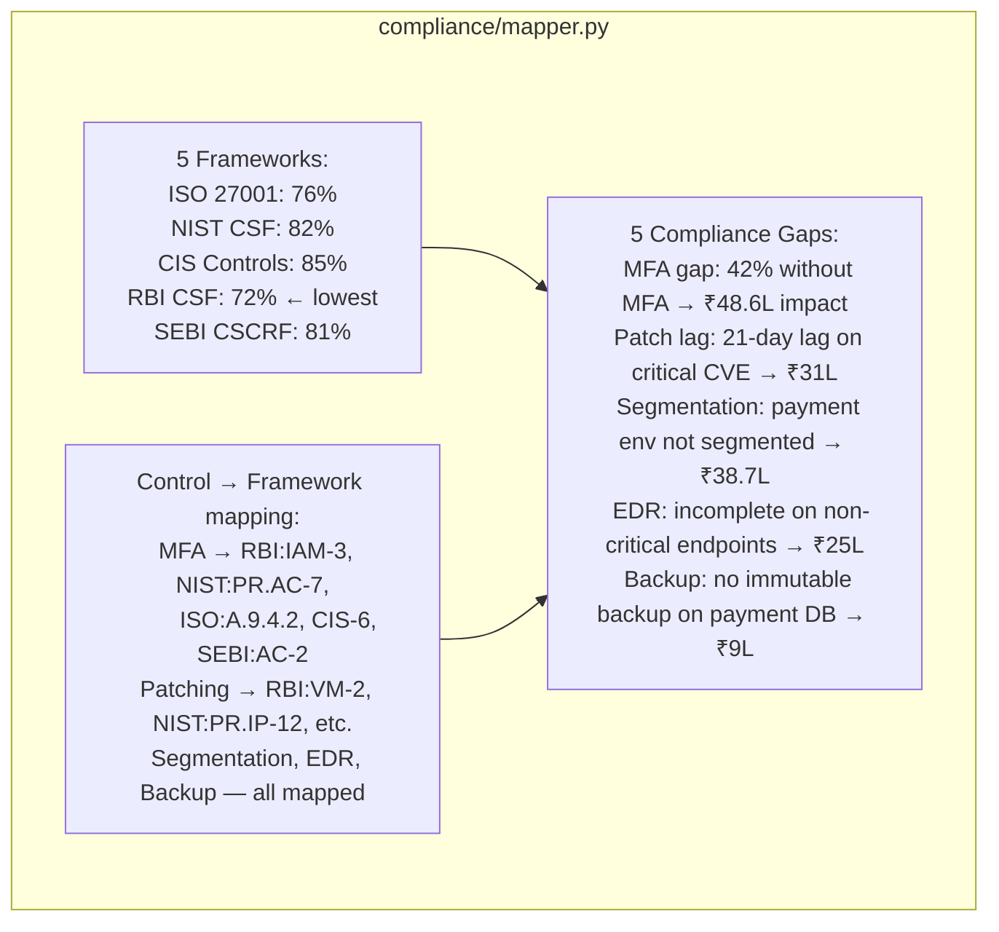

---

## 6. AI Layer Architecture

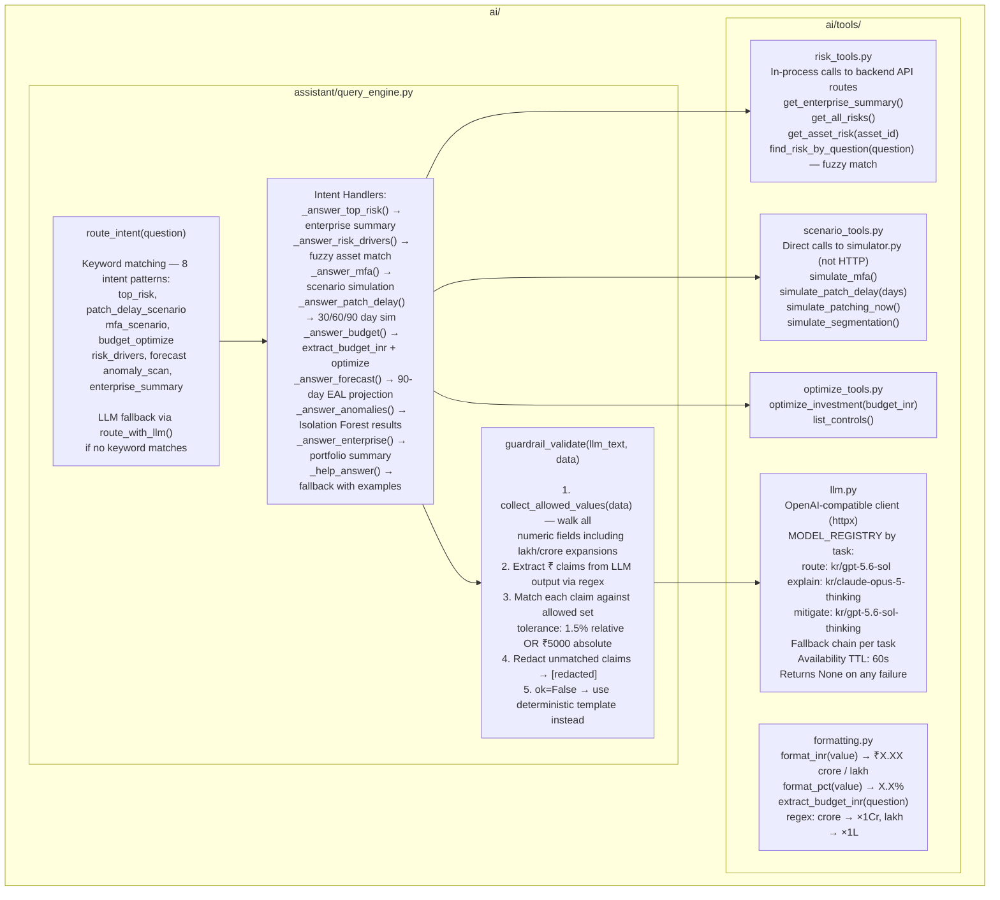

---

## 7. ML Pipeline Architecture

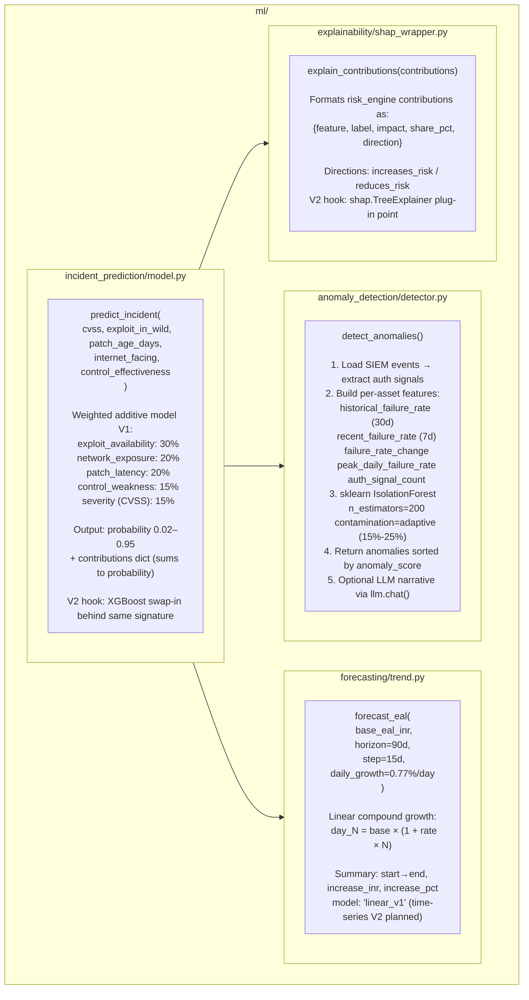

---

## 8. Frontend Architecture

```mermaid
graph TD
    subgraph fe["frontend/ — React + TypeScript"]
        subgraph pages["src/pages/ — 20 route pages"]
            SD["SecurityDashboard.tsx"]
            FD["FinancialDashboard.tsx"]
            RK["Risks.tsx"]
            SC["Scenarios.tsx"]
            INV["Investments.tsx"]
            COMP_P["Compliance.tsx"]
            FIND["Findings.tsx"]
            ASSET["Assets.tsx"]
            TI_P["ThreatIntelligence.tsx"]
            VULN["Vulnerabilities.tsx"]
            REC["Recommendations.tsx"]
            RQ["RemediationQueue.tsx"]
            CS["CodeSecurity.tsx"]
            CLD["CloudSecurity.tsx"]
            IS["IdentitySecurity.tsx"]
            SS["ScaSbom.tsx"]
            SEC["Secrets.tsx"]
            POL["Policies.tsx"]
            REP["Reports.tsx"]
            SET["Settings.tsx"]
        end

        subgraph comp_fe["src/components/"]
            CHARTS["charts/\n  ComplianceRadar.tsx\n  FinancialBreakdownBar.tsx\n  InteractiveTrendChart.tsx\n  RiskDonut.tsx\n  RiskTrendChart.tsx"]

            DASH_C["dashboard/\n  FindingsSummary.tsx\n  RiskPostureCard.tsx\n  SecurityInsights.tsx\n  SecurityPipeline.tsx"]

            COMMON["common/ — 20 shared UI components\n  AIAdvisorChat.tsx\n  KPICard.tsx\n  DataTable.tsx\n  CommandPalette.tsx\n  Terminal.tsx\n  RiskScoreBadge.tsx\n  SeverityBadge.tsx\n  CountUp.tsx\n  Carousel.tsx\n  FilterBar.tsx\n  + 10 more"]

            AP["attackpath/\n  AttackPathGraph.tsx\n  NodeDetailPanel.tsx"]

            LAYOUT["Layout/\n  Sidebar.tsx\n  TopBar.tsx"]
        end

        subgraph lib_fe["src/lib/ & src/services/"]
            API_C["api/client.ts — axios wrapper"]
            STORE["store.ts — Zustand state"]
            TOAST["toastStore.ts"]
            UI_S["uiStore.ts"]
        end

        subgraph demo_fe["src/demo/"]
            DS["demoStore.ts — mock state"]
            EB["eventBus.ts — live event sim"]
            FIX["fixtures.ts — demo data"]
        end
    end

    subgraph prod["crispr_products/ — Lovable product shell"]
        subgraph routes_p["src/routes/"]
            DASH_R["dashboard.tsx"]
            FIN_R["financial.tsx"]
            BUD_R["budget.tsx"]
            COMP_R["compliance.tsx"]
            SCEN_R["scenarios.tsx"]
            ADV_R["advisor.tsx"]
            ARCH_R["architecture.tsx"]
            HOW_R["how-it-works.tsx"]
            CORR_R["correlation.tsx"]
            DRIV_R["drivers.tsx"]
            PIP_R["pipeline.tsx"]
            REC_R["recommendations.tsx"]
        end

        subgraph crispr_comp["src/components/crispr/"]
            ANIM["animated-number.tsx"]
            DIAL["score-dial.tsx"]
            SHELL["shell.tsx"]
        end

        subgraph lib_p["src/lib/"]
            DATA["crispr-data.ts — typed risk data"]
        end
    end
```

---

## 9. Database Schema

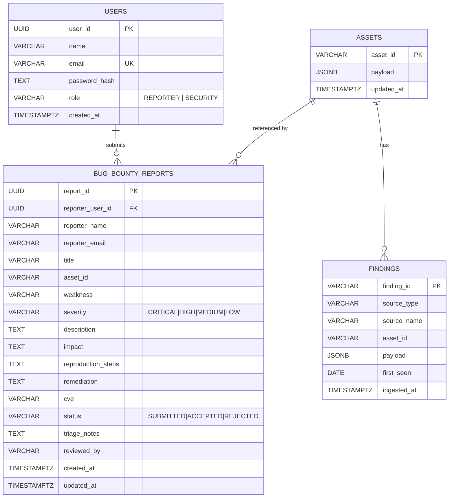

---

## 10. API Architecture

```mermaid
graph LR
    subgraph main_api["FastAPI — backend/app/main.py\nport 8000"]
        F["/api/findings"]
        A["/api/assets"]
        R["/api/risks"]
        SC_A["/api/scenarios"]
        O["/api/optimize"]
        C["/api/compliance"]
        AS["/api/assistant"]
        H["/api/health"]
    end

    subgraph ing_api["FastAPI — backend/app/ingestion_main.py\nport 8001"]
        AUTH["/api/auth\n  POST /register\n  POST /login\n  GET /me"]
        BB["/api/bug-bounty\n  POST /reports\n  GET /reports\n  GET /reports/{id}\n  PATCH /reports/{id}/review"]
        ING["/api/ingestion\n  GET /status\n  POST /refresh"]
        FIND_ING["/api/findings"]
    end

    subgraph endpoints["Key Endpoints"]
        R1["GET /api/risks\n→ all risk cases ranked by EAL"]
        R2["GET /api/risks/enterprise\n→ portfolio summary + top risk"]
        R3["GET /api/risks/{asset_id}\n→ single asset risk case"]
        S1["GET /api/scenarios\n→ what-if with query params"]
        S2["GET /api/scenarios/presets\n→ 4 preset scenarios with ROSI"]
        O1["POST /api/optimize\n→ {budget_inr} → selected controls"]
        O2["GET /api/optimize/controls\n→ full control catalogue"]
        AI1["POST /api/assistant/query\n→ {question} → NL answer"]
        AI2["GET /api/assistant/forecast\n→ 90-day EAL trajectory"]
        AI3["GET /api/assistant/anomalies\n→ Isolation Forest results"]
    end

    main_api --> endpoints
```

---

## 11. Deployment Architecture

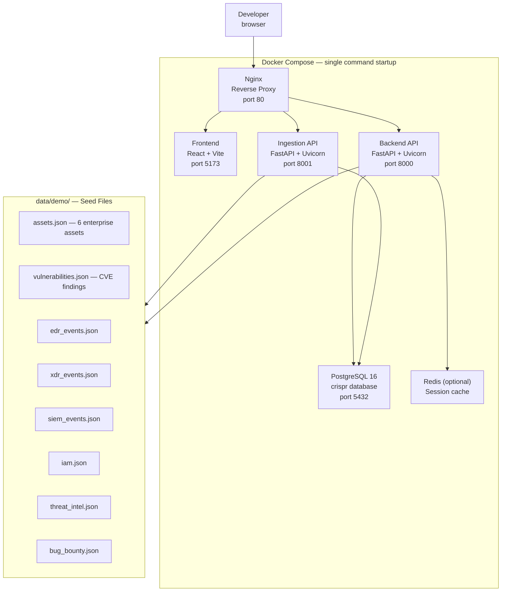

---

## 12. Security Architecture

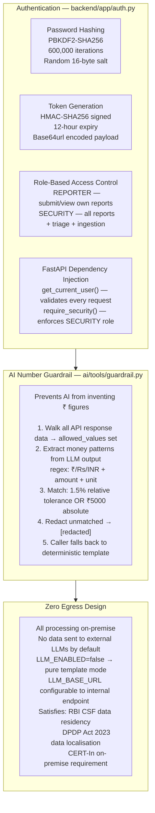

---

## Appendix: Key Files Quick Reference

| File | Owner | Purpose |
|---|---|---|
| `backend/constants.py` | Shared | India penalty constants, downtime costs |
| `backend/risk_engine/likelihood.py` | Member 3 | FAIR likelihood formula |
| `backend/financial_engine/loss_calculator.py` | Member 3 | Loss magnitude + EAL |
| `backend/risk_engine/drivers.py` | Member 3 | Risk factor explanation |
| `backend/correlation/correlator.py` | Member 2 | Multi-source confidence engine |
| `backend/normalization/normalizer.py` | Member 2 | Finding validation pipeline |
| `backend/optimizer/knapsack.py` | Member 5 | PuLP + greedy optimizer |
| `backend/scenario_engine/simulator.py` | Member 5 | What-if simulation |
| `backend/compliance/mapper.py` | Member 5 | Framework mapping |
| `ai/assistant/query_engine.py` | Member 4 | NL intent routing |
| `ai/tools/guardrail.py` | Member 4 | Number hallucination prevention |
| `ml/anomaly_detection/detector.py` | Member 4 | Isolation Forest login anomaly |
| `ml/forecasting/trend.py` | Member 4 | EAL growth projection |
| `backend/connectors/` | Member 1 | 7 data source adapters |
| `backend/ingestion/store.py` | Member 1 | PostgreSQL ingestion store |
| `backend/app/api/bug_bounty.py` | Member 1 | Bug bounty portal APIs |
| `frontend/src/` | Member 6 | React dashboard — 20+ pages |
| `crispr_products/src/` | Member 6 | Lovable product shell |